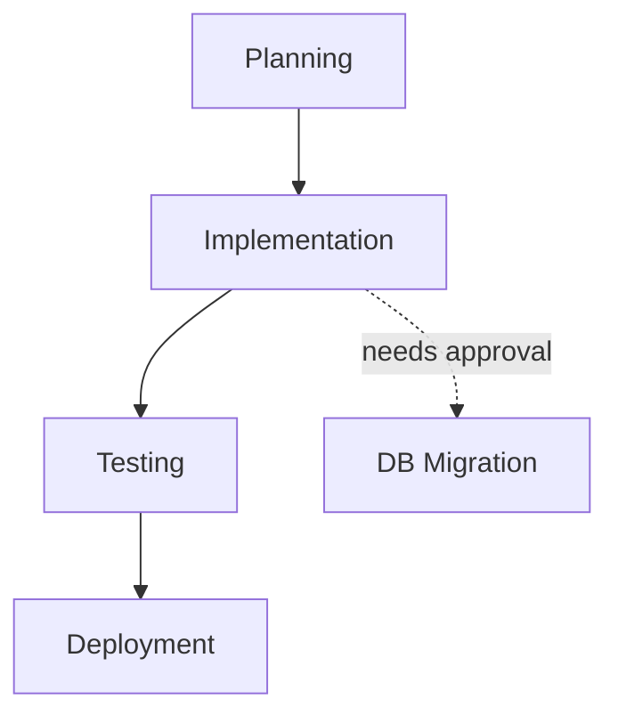

# Context.md Integration Example

This document shows how to integrate context.md into an existing skill with before/after examples.

---

## Example 1: Simple Development Skill

### BEFORE (No Context)

```markdown
# my-dev-skill

You are a development assistant. Help users write code and fix bugs.

## On Invocation
1. Ask the user what they want to build
2. Write the code
3. Test it
4. Done
```

**Problem**: No memory of previous sessions, user must re-explain context every time.

---

### AFTER (With Context)

```markdown
# my-dev-skill

You are a development assistant. Help users write code and fix bugs.

## Context Management

### On Session Start
1. Check for existing `context.md` in project root or `.claude/` directory
2. If exists:
   - Read and parse for current state
   - Load "What I Know About This User" for preferences
   - Check "Pending Items" for incomplete tasks
   - Acknowledge continuity: "I see we were working on [X]. Should I continue?"
3. If not exists:
   - Ask: "Should I create a context.md to track our work?"
   - If yes, create from template with initial discovery

### During Session
Update `context.md` when:
- **New files created**: Add to "What Exists" section
- **Bug fixed**: Log in "Recent Activity"
- **User states preference**: Add to "What I Know About This User"
- **Decision made**: Record in "Current State > Decisions Made This Session"

### On Session End
1. Update "Recent Activity" with session summary
2. Update "Current State" with pending items
3. Update "Last Sync" timestamp
4. If in git repo, stage context.md (don't auto-commit without permission)

## On Invocation
1. **Load Context** (see Context Management above)
2. If context exists and has pending items:
   - Present pending items to user
   - Ask which to continue
3. If no context or no pending:
   - Ask the user what they want to build
4. Write the code
5. Test it
6. **Update Context** with results
7. Done
```

**Benefits**:
- User doesn't repeat themselves
- Skill remembers decisions and preferences
- Can resume work seamlessly
- Logs progress for review

---

## Example 2: Testing Skill Integration

### BEFORE (No Context)

```markdown
# testing-skill

Run tests on the application.

## Steps
1. Find test files
2. Run tests
3. Report results
```

**Problem**: No tracking of flaky tests, known issues, or test history.

---

### AFTER (With Context)

```markdown
# testing-skill

Run tests on the application with intelligent state tracking.

## Context Management

### On Session Start
1. Check for `.claude/skills/testing-agent/context.md`
2. If exists:
   - Load "Known Flaky Tests" from context
   - Check "Last Test Run" timestamp
   - Load "Test Coverage" metrics
3. Query memory for test patterns:
   ```javascript
   mcp__memory__search_nodes({ query: "test-pattern:" })
   mcp__memory__search_nodes({ query: "common-bug:" })
   ```

### During Session
Update context when:
- **Test fails**: Log in "Recent Activity" with error details
- **Flaky test detected**: Add to custom section "Known Flaky Tests"
- **New test created**: Update "Test Coverage" section
- **Bug found**: Cross-reference with memory (common-bug entities)

### Custom Context Sections
Add these to standard context-template.md:

```markdown
## Test Coverage

### Unit Tests
- Files covered: [X/Y]
- Coverage %: [Z%]
- Last run: [timestamp]

### Integration Tests
- Endpoints covered: [list]
- Last run: [timestamp]

### E2E Tests
- User flows covered: [list]
- Last run: [timestamp]

## Known Flaky Tests

| Test Name | Failure Rate | Last Failed | Issue |
|-----------|--------------|-------------|-------|
| login-test | 15% | 2026-01-29 | Race condition |
| api-timeout | 8% | 2026-01-28 | External API |

## Found Bugs

- [ ] #1: Auth flow breaks on logout (2026-01-29)
- [x] #2: API returns 500 on invalid input (2026-01-28) - FIXED
```

### On Session End
1. Update test metrics
2. Generate test report (append to `.claude/test-history/`)
3. Update "Last Sync" timestamp

## Steps
1. **Load Context** and memory patterns
2. Find test files
3. **Check Known Flaky Tests** - retry with special handling
4. Run tests
5. **Cross-reference failures** with memory (common-bug)
6. Report results
7. **Update Context** with metrics and new flaky tests
```

**Benefits**:
- Tracks flaky tests automatically
- Maintains test history
- Cross-references with memory for known patterns
- Generates historical reports

---

## Example 3: Multi-stage Orchestrator Skill

### BEFORE (No Context)

```markdown
# product-builder-skill

Build a complete product from idea to deployment.

## Stages
1. Planning
2. Implementation
3. Testing
4. Deployment
```

**Problem**: If interrupted mid-stage, must start over or user must explain where they left off.

---

### AFTER (With Context)

```markdown
# product-builder-skill

Build a complete product from idea to deployment with full state tracking.

## Context Management

### On Session Start
1. Check for `.claude/context.md`
2. If exists:
   - Parse "Current State > Stage Progress"
   - Load "Product Definition" section
   - Check for blocked stages
   - **Resume from last stage**: "I see we completed Planning and are 60% through Implementation. Should I continue with implementing the API endpoints?"

### Custom Context Structure

```markdown
# Context

[Standard sections...]

## Product Definition

**Product Name**: [name]
**Description**: [brief description]
**Target Users**: [who]
**Key Features**: [list]

## Stage Progress

### 1. Planning ✅ COMPLETE
- Started: 2026-01-28 10:00
- Completed: 2026-01-28 12:30
- Output: `docs/product-plan.md`

### 2. Implementation 🔄 IN PROGRESS (60%)
- Started: 2026-01-28 13:00
- Completed:
  - [x] Database schema
  - [x] API endpoints (3/5)
  - [ ] Frontend components (0/8)
  - [ ] Authentication
- Blockers: Need user to approve database migration

### 3. Testing ⏳ PENDING
- Blocked by: Implementation

### 4. Deployment ⏳ PENDING
- Blocked by: Testing

## Technical Decisions Log

| Date | Decision | Rationale | Impact |
|------|----------|-----------|--------|
| 2026-01-28 | Use PostgreSQL | Relational data model | All stages |
| 2026-01-28 | React + Vite | Modern stack preference | Frontend |
| 2026-01-29 | JWT auth | Stateless API | Security |

## Architecture Notes

- API: REST, port 3000
- Frontend: Vite dev server, port 5173
- Database: PostgreSQL, port 5432
- Deployment target: Vercel + Supabase
```

### During Session
Update context when:
- **Stage completes**: Mark with ✅, add completion timestamp
- **Progress made**: Update percentage and checklist
- **Blocker encountered**: Add to "Blockers" field
- **Technical decision**: Log in "Technical Decisions Log"

### On Session End
1. Calculate overall progress percentage
2. Update "Stage Progress" with current state
3. Update "Next Steps" based on current stage
4. Commit context.md with message: "chore(context): update progress to [X%]"

## Stages

### 1. Planning
- Create product definition
- **Update context** with Product Definition section
- Generate technical plan
- **Log decisions** in Technical Decisions Log

### 2. Implementation
- **Check context** for technical decisions to respect
- Implement stage by stage
- **Update progress** after each component
- **Log blockers** if encountered

### 3. Testing
- **Load context** for architecture details
- Run comprehensive tests
- **Cross-reference** with testing-skill context if available

### 4. Deployment
- **Verify context** shows all stages complete
- Deploy based on target in context
- **Update context** with deployment URLs
```

**Benefits**:
- Can pause and resume at any stage
- Full audit trail of decisions
- Clear blocker tracking
- Percentage-based progress visibility
- Handoff-ready for other skills or humans

---

## Pattern: Context + Memory Integration

### When to Use Both

```markdown
## On Session Start

1. **Load Context** (session state):
   ```bash
   # Check for context.md
   if [ -f "./context.md" ]; then
     # Load current project state
   fi
   ```

2. **Query Memory** (long-term learnings):
   ```javascript
   // Load user preferences
   const preferences = await mcp__memory__search_nodes({
     query: "preference:"
   });

   // Load relevant patterns
   const patterns = await mcp__memory__search_nodes({
     query: "pattern:react" // or relevant tech
   });

   // Load known mistakes to avoid
   const mistakes = await mcp__memory__search_nodes({
     query: "mistake:"
   });
   ```

3. **Merge into working context**:
   ```markdown
   ## My Guidelines

   ### From Memory (Long-term)
   - preference:async-await-over-promises
   - pattern:early-returns
   - mistake:never-swallow-errors

   ### From Context (This Project)
   - Use custom auth flow (see src/auth/)
   - Database migrations require approval
   - Deploy to staging before prod
   ```
```

---

## Integration Checklist

When adding context.md to an existing skill:

### 1. Planning Phase
- [ ] Identify what state needs to persist between sessions
- [ ] Determine if skill needs context (not all do!)
- [ ] Design custom sections beyond standard template
- [ ] Plan memory integration points

### 2. Implementation Phase
- [ ] Add "Context Management" section to skill instructions
- [ ] Implement "On Session Start" logic
- [ ] Add "During Session" update triggers
- [ ] Implement "On Session End" cleanup
- [ ] Add context discovery (check multiple locations)

### 3. Custom Sections
- [ ] Identify skill-specific state to track
- [ ] Design custom context sections
- [ ] Document section purposes

### 4. Memory Integration
- [ ] Identify what goes in memory vs context
- [ ] Add memory queries to session start
- [ ] Reference memory entities in context
- [ ] Update memory when creating generalizable patterns

### 5. Testing
- [ ] Test session resume from context
- [ ] Test context creation from template
- [ ] Test context updates during work
- [ ] Test without context (graceful degradation)
- [ ] Test context + memory integration

### 6. Documentation
- [ ] Update skill README with context usage
- [ ] Add examples showing context-aware behavior
- [ ] Document custom context sections
- [ ] Link to context-usage-guide.md

---

## Common Patterns

### Pattern 1: Progress Tracking
```markdown
## Stage Progress

### Current Stage: Implementation (Stage 2 of 4)
Progress: ████████░░░░░░░░░░ 40%

- [x] Step 1
- [x] Step 2
- [ ] Step 3
- [ ] Step 4
- [ ] Step 5
```

### Pattern 2: Decision Log
```markdown
## Decisions Made This Session

1. **[2026-01-30 13:15] Use TypeScript strict mode**
   - Rationale: Prevent type errors early
   - Impact: All new files
   - References: coding-standards.md

2. **[2026-01-30 13:45] Implement caching layer**
   - Rationale: API response time > 2s
   - Impact: API architecture
   - Trade-off: Added complexity vs performance
```

### Pattern 3: Blockers & Dependencies
```markdown
## Current Blockers

| Blocker | Blocking | Waiting On | Since |
|---------|----------|------------|-------|
| DB migration approval | Implementation | User decision | 2026-01-30 |
| API keys | Testing | DevOps team | 2026-01-29 |

## Dependencies


```

### Pattern 4: File Manifest
```markdown
## What Exists

### Generated This Session
- `src/api/auth.ts` - Authentication logic (2026-01-30 13:20)
- `src/api/users.ts` - User endpoints (2026-01-30 14:10)
- `tests/api/auth.test.ts` - Auth tests (2026-01-30 14:45)

### Modified This Session
- `src/config/database.ts` - Added connection pool (2026-01-30 13:15)
- `package.json` - Added jsonwebtoken dependency (2026-01-30 13:18)
```

---

## Tips for Success

1. **Start Simple**: Don't add every possible section. Add what you need.

2. **Update Incrementally**: Don't wait until session end. Update as you go.

3. **Use Timestamps**: Always timestamp actions for debugging and auditing.

4. **Cross-reference**: Link context to memory entities, don't duplicate.

5. **Keep it Scannable**: Use tables, checklists, and clear hierarchies.

6. **Archive Old Data**: Move old "Recent Activity" to archive files.

7. **Test Resume**: Periodically test that context enables smooth resume.

8. **Version Context**: If making breaking changes to context structure, version it.

---

## Troubleshooting Integration Issues

### Issue: Context not found on resume
**Solution**: Check all three locations (project root, .claude/, skill-specific)

### Issue: Context becoming too large
**Solution**: Archive old sections, keep only recent activity

### Issue: Context conflicts with memory
**Solution**: Context is source of truth for session, memory for long-term patterns

### Issue: Multiple skills updating same context
**Solution**: Use .claude/context.md for shared, .claude/skills/{name}/ for skill-specific

---

**Last Updated**: 2026-01-30
**For**: context-template.md v1.0
